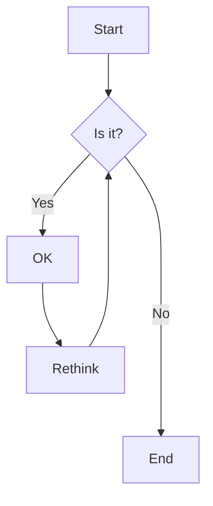
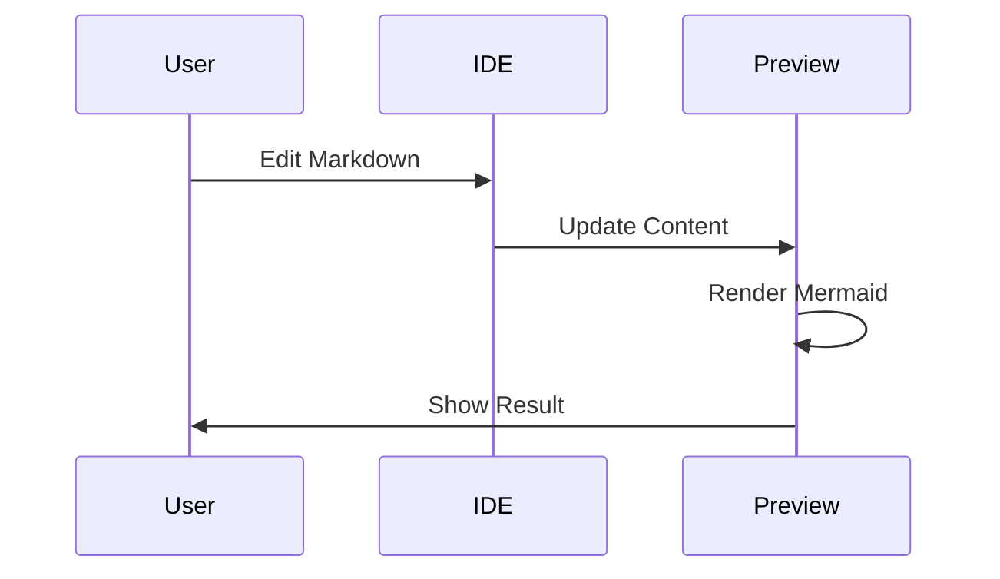

# Markdown Preview Test

This is a **test** of the markdown preview feature with *mermaid* support.

## Features

- Syntax highlighting
- Live preview
- Mermaid diagrams
- Code blocks

## Code Example

```javascript
function hello() {
  console.log("Hello, World!");
}
```

## Mermaid Diagram



## Another Diagram



## Table Example

| Feature | Status |
|---------|--------|
| Markdown | ✅ |
| Mermaid | ✅ |
| Live Preview | ✅ |

> This is a blockquote to test styling

**End of test document**
